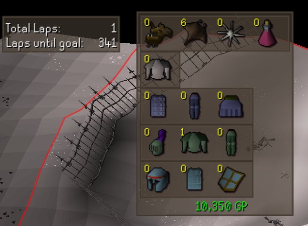
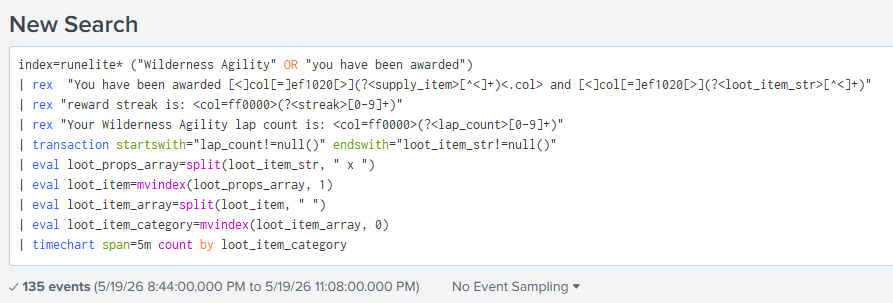
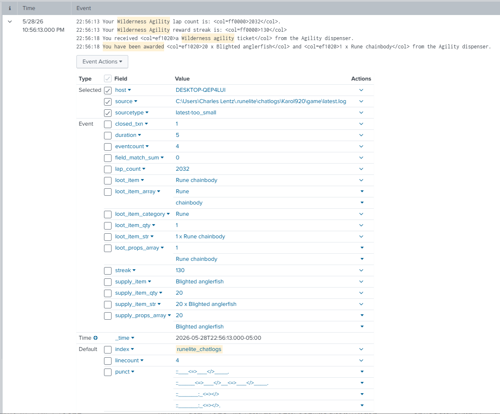
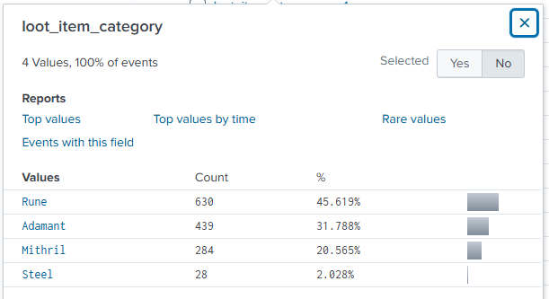
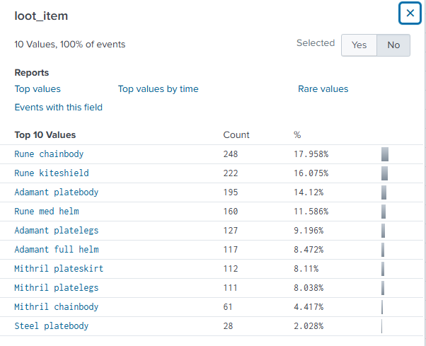
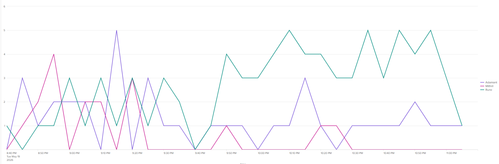
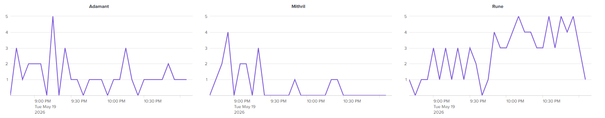

# Wildy Agility Loot Tracker

This document is currently a work-in-progress. Expect it to be incomplete and constantly changing. 

For now most everything is under [main/com.lita](src/main/java/com/lita) package. 

The files under [main/com.lita.LootUtils](src/main/java/com/lita/LootUtils) package are a 2nd revision to 
[LtaLootItem](src/main/java/com/lita/LtaLootItem.java). It is an incomplete, not-yet-implemented attempt to simplify
[LtaLootItem](src/main/java/com/lita/LtaLootItem.java), although it quickly went beyond the anticipated complexity and may in fact be worse than what it was supposed
to simplify. 

The main function of this plugin is to create an overlay showing what loot you have accumulated from your wildy laps
inside your loot bag, without you having to stop and open the loot bag to check every few minutes. 
You can see an early example of it in action here:

In time I hope to add a runelite sidepanel and perhaps make it configurable whether to display as an overlay,
a side panel, or both. 

---

## Some rudimentary JavaDocs are available.

### Tree Views:
- [com.lita](https://mr920.github.io/WildyAgilityLootTracker/com/lita/package-tree.html)
- [com.lita.LootUtils](https://mr920.github.io/WildyAgilityLootTracker/com/lita/LootUtils/package-tree.html)

### Summary Views:
- [com.lita](https://mr920.github.io/WildyAgilityLootTracker/com/lita/package-summary.html) - The main plugin package
    - [WildyAgilityLootTrackerConfig](https://mr920.github.io/WildyAgilityLootTracker/com/lita/WildyAgilityLootTrackerConfig.html) - Configuration for the plugin. Not yet fully functioning. 
    - [WildyAgilityLootTrackerPlugin](https://mr920.github.io/WildyAgilityLootTracker/com/lita/WildyAgilityLootTrackerPlugin.html) - the core business logic for the plugin as a whole. The main orchestrator.
    - [WildyAgilityLootTrackerOverlay](https://mr920.github.io/WildyAgilityLootTracker/com/lita/WildyAgilityLootTrackerOverlay.html) - Everything related to the display structure, the overlay's panelComponents, etc
    - [WildyAgilityChatParser](https://mr920.github.io/WildyAgilityLootTracker/com/lita/WildyAgilityChatParser.html) - As simple as it sounds. Just a regex parser-module to take GAME_MESSAGE type chatMessages and pull out the valuable data from the messages that match the pattern of 1 of the 3 primary Wilderness Agility format chat messages that we are looking for.
    - [WildyAgilityGameArea](https://mr920.github.io/WildyAgilityLootTracker/com/lita/WildyAgilityGameArea.html) - the core active game area in which this plugin responds to. This module will track when you Enter or Exit this "Zone". See additional screenshot below. Courtesy of [This Website](https://mejrs.github.io/osrs?m=-1&z=2&p=0&x=3034&y=3929&layer=labels)
      
    - [WildyAgilitySession](https://mr920.github.io/WildyAgilityLootTracker/com/lita/WildyAgilitySession.html) - Work in progress session-management and tracking object. Mostly a placeholder for now. More features coming soon.
    - [WildyAgilityDebugHelper](https://mr920.github.io/WildyAgilityLootTracker/com/lita/WildyAgilityDebugHelper.html) - Not much to see here. Just some quality-of-life functions and things. 
    - [LtaLootItemImage](https://mr920.github.io/WildyAgilityLootTracker/com/lita/LtaLootItemImage.html) - Stupid very basic little wrapper for ImageComponent that is hardly worth mentioning
    - [LtaLootItem](https://mr920.github.io/WildyAgilityLootTracker/com/lita/LtaLootItem.html) - The core datatype being used as the backbone for both display and book-keeping of the LootItems you are receiving from the course. This class got out of hand really fast and I do apologize for its unnecessary complexity. The rewrite attempt was a bust. 3rd try will go better maybe. 
- [com.lita.LootUtils](https://mr920.github.io/WildyAgilityLootTracker/com/lita/LootUtils/package-summary.html) - The overly complex replacement for LtaLootItem that may-or-may-not ever get finished
---

## Additional Resources
- [Main RuneLite API](https://static.runelite.net/runelite-api/apidocs/)
- [Main RuneLite Client API](https://static.runelite.net/runelite-client/apidocs/)  
- [Gradle Settings](https://docs.gradle.org/8.10/javadoc/org/gradle/api/initialization/Settings.html) - corresponds to [settings.gradle](settings.gradle) file
- [Gradle Project](https://docs.gradle.org/8.10/javadoc/org/gradle/api/Project.html) - corresponds to [build.gradle](build.gradle) file
- [Logback Configuration](https://logback.qos.ch/manual/configuration.html) 
- [RuneLite Development Logging](https://github.com/runelite/runelite/wiki/Plugin-Development-Logging)

---

## Things I still need to figure out myself
- [runelite-plugin.properties](runelite-plugin.properties) 
- more to come as I remember stuff

---

## Original Motivation - Splunk Log Parsing
This all started when I setup a splunk instance to ingest RuneLite client, game, and chat logs. I noticed that you could
parse out the logs with some simple regex and then use that to create some very neat metrics and things. 
Splunk allows you to search logs like so:

and then gives you the ability to parse log entries into fields:

and then to immediately start pulling statistics out based upon those fields:
 

and you can even turn around and use those statistics to generate charts and things:

After realizing that these log messages were consistent enough in their structure to be parsed in this way, I realized
that a plugin could be made to do the same thing. It could just parse out the gameMessages and use the data to keep
an accounting record of your loot over time, and even display your total cumulative loot value for you.

And that's how I got the idea for this. As such, I hope to be able to provide some good logs and machine-parseable
historical data in the final revision of the plugin. But this will take some time.